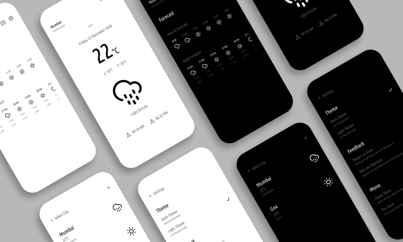

# Weather app

Live [https://szymii-weather-app.netlify.app](https://szymii-weather-app.netlify.app)

## Screenshots

## Built with

- [React](https://reactjs.org/)
- [Redux Toolkit](https://redux-toolkit.js.org/)
- [Styled Components](https://styled-components.com/)
- [Custom Webpack Config](https://webpack.js.org/)
- [OpenWeather API](https://openweathermap.org/)

## Run on your own

- You will probably need node v16
- This project is a little bit legacy so to instal use `npm install --legacy-peer-deps`
- create .env file and add `API_KEY="your_open_weather_api_key"`
- run `npm start` and open `http://localhost:8080/`
